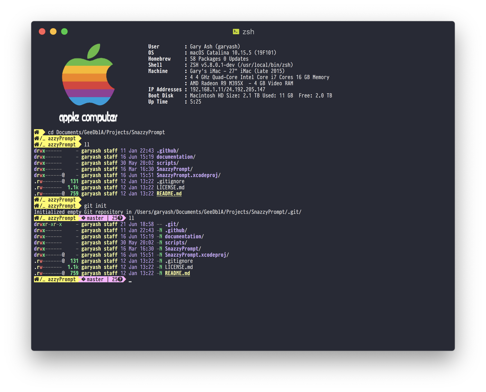

## Snazzy Powerline Style Terminal Prompt

This repository contains my snazzy [Powerline](https://powerline.readthedocs.io/en/latest/index.html) style terminal prompt

**Options Environment Variable:**. 
SNAZZY_PROMPT=<Segment Name>,Foreground color,Background color[,Alternate Foreground color,Alternate Background color];<next segment spec>

Segment Names:
*  *cwd* Current working directory
*  *error* Error status of the last command
*  *git* git status if the current directory is a git working tree
*  *machine* machine/host name
*  *user* user name

Note: libgit2 is required.I used [homebrew](https://brew.sh) to install it *brew install libgit2*  \

